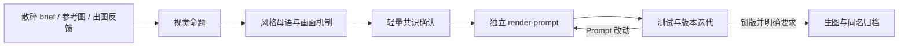

# Image Prompt Director

一个面向海报、品牌 KV 与视觉传播任务的 Codex Skill。

它不是把 brief 被动整理成一堆风格词，而是先像资深美术指导一样判断：画面要让人先看到什么、记住什么、牺牲什么，再把这套判断编译成可直接投喂生图模型的独立结构化 Prompt。

## 它解决什么问题

普通生图 Prompt 很容易出现几类问题：需求都写到了，但画面仍然平庸；风格词很多，却像不同素材的拼凑；“高级、电影感、有质感”停留在形容词；局部迭代依赖上一版 Prompt，导致版本无法独立使用。

Image Prompt Director 用一套轻量但有判断力的流程处理这些问题：

- 先建立一句可见、可执行的**视觉命题**。
- 用 `1 个主风格 + 最多 2 个辅助影响` 建立统一的**风格母语**。
- 从内置中英风格词库查询候选风格、配色和构图词，再翻译为专业可执行的 style formula。
- 把抽象审美要求翻译成构图、尺度、留白、光学、材质、文字行为和制作方式。
- 明确第一眼、第二层信息和细看奖励，避免所有元素同时争夺注意力。
- 主动指出模型俗套，并为核心画面决定“保留什么、舍弃什么”。
- 每一版 Prompt 都完整独立，不使用“保持上一版不变”之类的跨版本补丁。
- 每完成一个版本，在 Prompt 与记录链接后列出本版参考图链接、上传顺序、优先级和作用，并注明不再引用的旧图。

## 核心工作流



默认只进行一轮高密度梳理和一次共识确认。只有真正会改变路线的歧义，才继续追问。

## 主要能力

### 正向导演

把零散想法、传播目标、文案和参考图转成具有明确视觉主张的单画面 Prompt。Agent 会主动提出构图、风格、画法、材质、字体、色彩和记忆点建议，而不只是复述需求。

### 图片反推

从参考图中提炼可复现的生成机制，包括主体动作、空间关系、构图骨架、文字行为、光影材质和风格语言，而不是只罗列画面元素。

### 多风格合成

用模型敏感的英文术语建立主次明确的风格配方，例如：

```text
cinematic editorial photography
× spatial Chinese sound typography
× tactile material realism
```

每个辅助影响只负责一个子系统，并写清它在最终画面中的可见效果，避免平均混合造成拼凑感。

### 复杂关系可视化

面对多参考图、图层遮挡、文案与 icon 位置、多比例适配或复杂版式时，可在环境支持的情况下调用 `$visualize`，用结构图、线框或对比界面辅助拍板，减少直接阅读长 JSON 的负担。

### 版本化迭代

- 大版本：核心瞬间、叙事、构图机制、风格家族或参考角色发生变化。
- 小版本：动作、裁切、局部色光材质、文字层级或限制调整。
- 补丁版本：不影响画面的错字或数据修正。

旧版本只读；新版本复制后局部修改，但最终文件仍然是一份完整、独立、可单独投喂的 Prompt。

### 锁版后生图

默认只导演和管理 Prompt。只有用户锁定版本并明确要求直接生成时，才在环境支持的情况下调用 `$imagegen`，使用当前 Prompt 和相关参考图生图，并按 Prompt 同名归档成果。

## 安装

将仓库直接克隆到 Codex 的个人 Skills 目录：

```bash
git clone https://github.com/tft873919-glitch/image-prompt-director.git \
  "${CODEX_HOME:-$HOME/.codex}/skills/image-prompt-director"
```

已经安装后，可在该目录更新：

```bash
git -C "${CODEX_HOME:-$HOME/.codex}/skills/image-prompt-director" pull --ff-only
```

## 如何使用

在 Codex 中直接用自然语言开始，不需要先准备 JSON：

```text
我想做一张冬夜送达主题的竖版品牌海报。门外很冷，门内很暖，
想让“咚咚咚”参与画面，但我还没想好具体构图。
```

也可以从其他模式进入：

```text
反推这张参考图的构图、字体和材质机制，不要复制原图内容。

这是上一轮的出图，人物对了，但画面太普通、材质太塑料，帮我判断问题再迭代。

这个版本已经锁定，用当前 Prompt 和全部有效参考图直接生成。
```

Skill 会先与你确认视觉命题和关键取舍；达成共识后才生成 Prompt 文件，不会一开始就抛出大段 JSON。

## 输出结构

项目内容与纯生图 Prompt 分开管理：

```text
prompt/<中文项目名>/
├── <中文项目名>_记录.md
├── <中文项目名>_v1.0.0.md
└── <中文项目名>_v1.0.0_1000字符.md   # 按需生成

outputs/<中文项目名>/
└── <中文项目名>_v1.0.0.png           # 锁版生图后生成
```

- `记录.md`：保存 brief、参考图分工、美术判断、拍板、反馈、版本时间和成果链接。
- `vX.Y.Z.md`：只保存当前画面的纯结构化 Prompt，可整文件直接投喂。
- `1000字符.md`：从长版压缩得到的独立 Prompt，不依赖长版补充信息。

默认运行 Prompt 使用 `render-prompt` JSON。只有明确需要建立可复用视觉系统时，才生成 Cookbook v2.1 `style-spec`；包含多案例的风格规格不会直接作为单幅画面的生图输入。

## 仓库结构

```text
.
├── SKILL.md
├── agents/
│   └── openai.yaml
├── references/
│   ├── art-direction.md
│   ├── style-library.md
│   ├── style-language.md
│   ├── output-format.md
│   ├── visual-communication.md
│   ├── image-generation.md
│   └── cookbook-reuse.md
└── scripts/
    ├── sync_cookbook.py
    ├── validate_prompt_md.py
    ├── validate_record_links.py
    ├── bump_prompt.py
    └── apply_prompt_changes.py
```

## Prompt Cookbook

本 Skill 可按需检索 [VigoZhao/AI-Visual-Prompt-Cookbook](https://github.com/VigoZhao/AI-Visual-Prompt-Cookbook)，复用其中的构图、字体行为、材质或色彩机制。

Cookbook 使用全局轻量缓存，只保留结构化 `style.json`、目录、schema 和缩略图；不会在每个项目里重复下载完整仓库，也不会默认把整份风格 JSON 塞进单画面 Prompt。

Cookbook 原项目采用 MIT License，相关结构与提示词写法归原项目作者所有。
